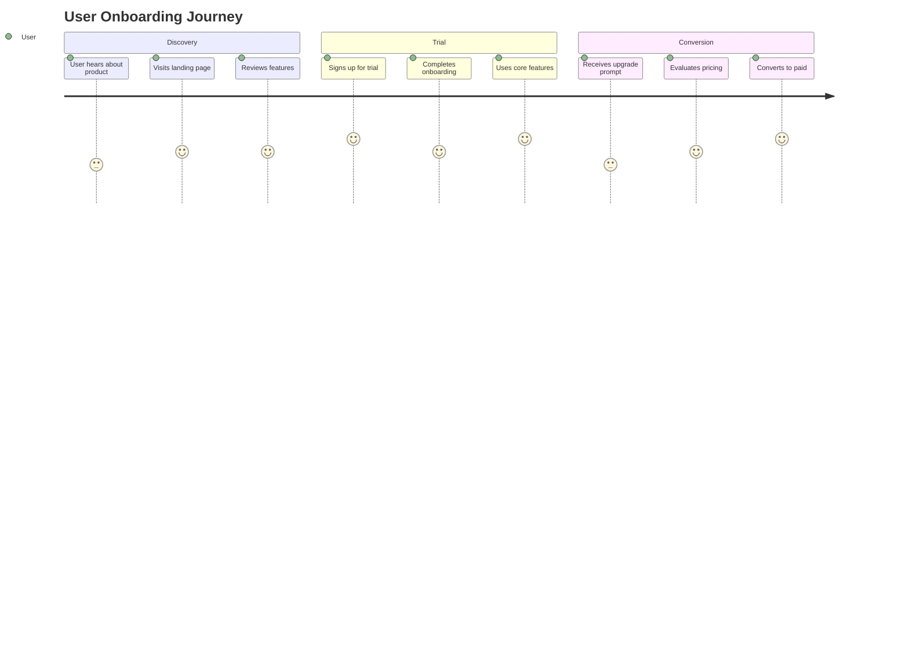
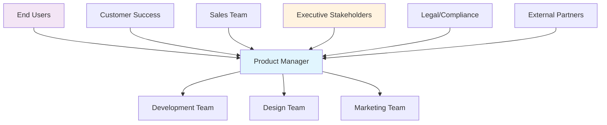
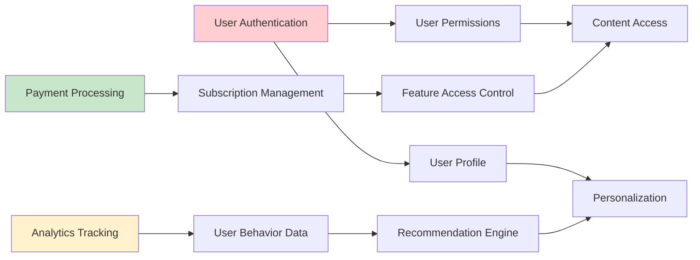
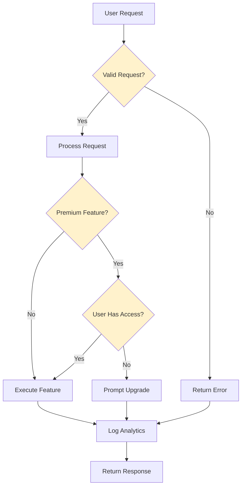
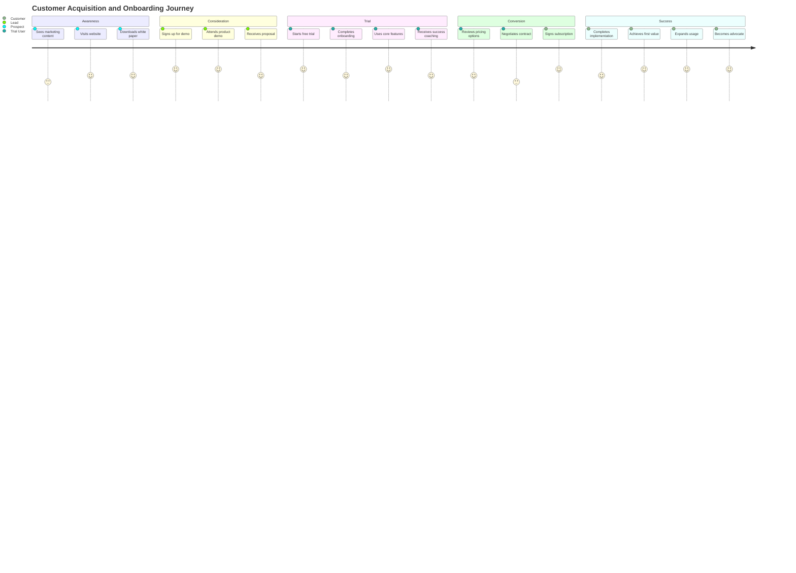
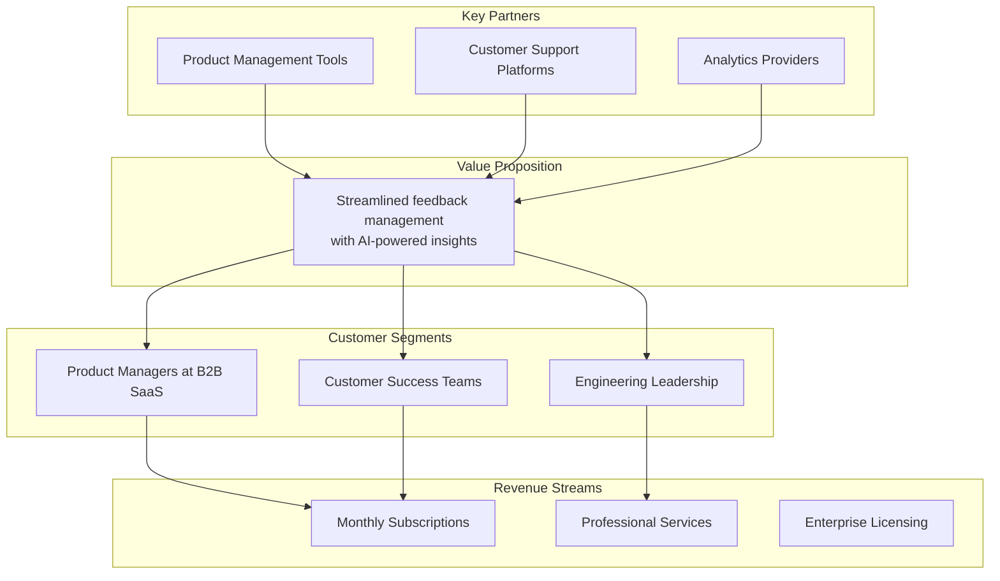
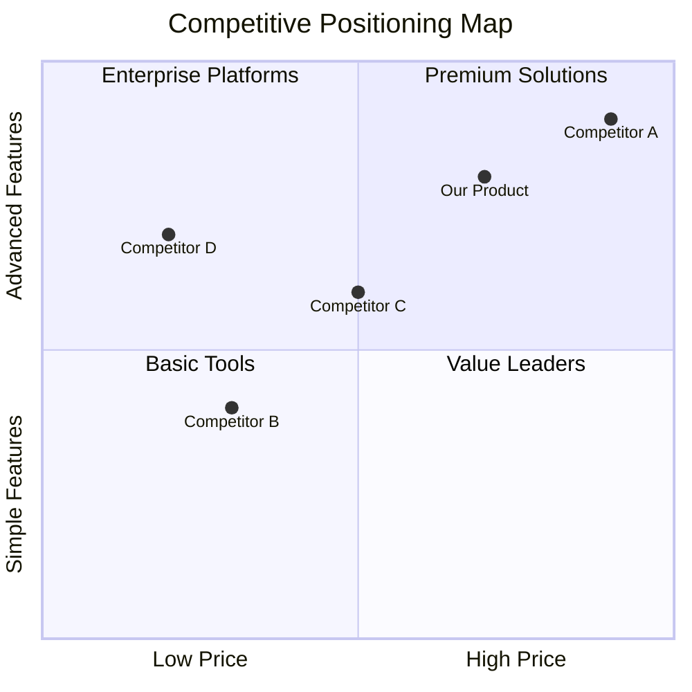
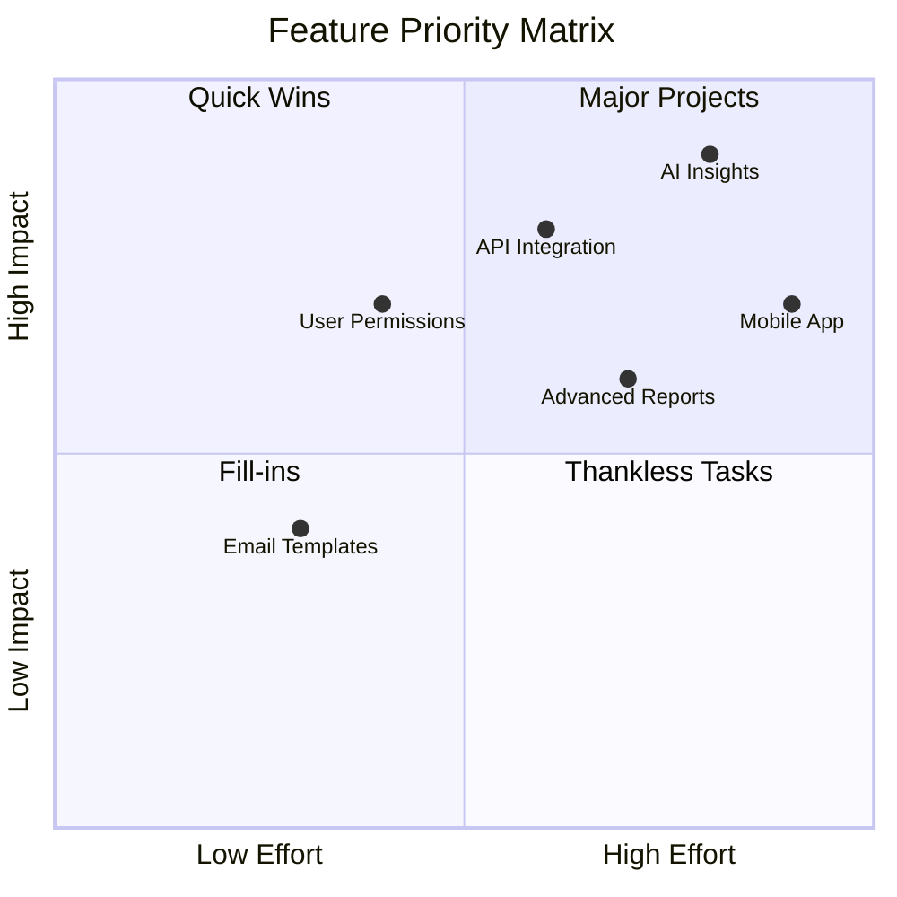

# PRD Generator

Generate comprehensive Product Requirements Documents (PRDs) based on the provided $ARGUMENTS. This command supports two modes:

1. **Description Mode**: When $ARGUMENTS contains a product or feature description, generate a complete PRD from requirements
2. **Code Analysis Mode**: When $ARGUMENTS contains a file or directory path, reverse-engineer a PRD by analyzing existing implementation

The PRDs will be placed in the `prds/` folder following a structured hierarchy and business-focused approach.

### Mode 1: Description Analysis Phase

When generating PRDs from a product/feature description, perform the following business analysis:

#### Product Discovery Analysis
- **Extract core problem statement** and market opportunity from the description
- **Identify target users and personas** mentioned or implied in requirements
- **Understand business goals** and value proposition
- **Determine market positioning** and competitive considerations
- **Assess product-market fit** indicators and assumptions
- **Define success criteria** and key performance indicators

#### User Experience Analysis
- **Map user journeys** and key workflows described
- **Identify pain points** and user needs being addressed
- **Define user stories** and acceptance criteria
- **Understand user expectations** for functionality and performance
- **Assess accessibility** and inclusive design requirements
- **Define user onboarding** and adoption strategies

#### Business Requirements Analysis
- **Extract functional requirements** from the description
- **Identify non-functional requirements** (performance, scalability, security)
- **Understand compliance** and regulatory requirements
- **Assess integration needs** with existing systems or platforms
- **Define data requirements** and privacy considerations
- **Identify monetization** and business model implications

#### Description Phase Checklist
- [ ] Core problem and opportunity clearly identified
- [ ] Target users and personas documented
- [ ] Business goals and success metrics defined
- [ ] User journeys and workflows mapped
- [ ] Functional and non-functional requirements extracted
- [ ] Constraints and dependencies identified

### Mode 2: Code Analysis Phase

When reverse-engineering PRDs from existing code, analyze the implementation to understand:

#### Product Functionality Analysis
- **Identify user-facing features** and capabilities from the codebase
- **Extract business rules** and logic patterns from implementation
- **Understand data models** and user information architecture
- **Map user workflows** based on application flow and routing
- **Identify integration points** with external services or APIs
- **Assess feature completeness** and functional scope

#### User Experience Analysis
- **Analyze user interface patterns** and interaction design
- **Understand user permissions** and role-based access
- **Map user journey flows** through the application
- **Identify user onboarding** and authentication patterns
- **Assess responsive design** and multi-platform support
- **Document accessibility features** and considerations

#### Business Logic Analysis
- **Extract validation rules** and business constraints from code
- **Understand pricing** and monetization logic
- **Identify workflow states** and business process flows
- **Analyze reporting** and analytics capabilities
- **Document compliance features** and security measures
- **Assess scalability patterns** and performance considerations

#### Code Analysis Phase Checklist
- [ ] All user-facing features catalogued and described
- [ ] Business rules and validation logic extracted
- [ ] User workflows and journeys mapped from code flow
- [ ] Integration points and external dependencies identified
- [ ] Business logic and constraints documented
- [ ] Performance and scalability characteristics assessed

### 3. PRD Generation

Create comprehensive PRDs following this business-focused structure:

#### Main PRD File: `prds/<product>.md`

```markdown
# <Product Name> - Product Requirements Document

## Executive Summary
[2-3 paragraph overview of the product, its purpose, target market, and key value proposition]

## 1. Context

### Problem Statement
[Clear description of the problem this product solves, supported by data or user research when available]

### Target Audience
[Detailed user personas and target market segments]
- **Primary Users:** Demographics, needs, behaviors, pain points
- **Secondary Users:** Additional stakeholders who interact with the product
- **Market Size:** Addressable market and opportunity sizing

### Product Vision
[Aspirational statement of what the product aims to achieve and its long-term impact]

### Business Case
[Rationale for building this product, including business value and strategic alignment]
- Revenue opportunity and business model
- Competitive advantages and differentiation
- Strategic importance to company goals
- Resource investment justification

## 2. Goals & Requirements

### Primary Objectives
[High-level business goals the product must achieve]
- **Goal 1:** Specific, measurable objective with timeline
- **Goal 2:** Specific, measurable objective with timeline
- **Goal 3:** Specific, measurable objective with timeline

### Success Metrics & KPIs
[Quantifiable measures of product success]
- **User Metrics:** Active users, retention rates, engagement metrics
- **Business Metrics:** Revenue, conversion rates, customer acquisition cost
- **Product Metrics:** Feature adoption, user satisfaction, performance metrics
- **Technical Metrics:** Uptime, response times, error rates

### Key Features & Functionality
[Core product capabilities and user-facing features]
- **Must-Have Features:** Critical functionality for MVP or core product
- **Should-Have Features:** Important features for competitive advantage
- **Could-Have Features:** Nice-to-have enhancements for future consideration

### User Experience Requirements
[Standards and expectations for user interaction]
- Usability and accessibility standards
- Performance expectations (load times, responsiveness)
- Multi-platform and device support requirements
- Internationalization and localization needs

### Quality Requirements
[Non-functional requirements and quality standards]
- Performance benchmarks and scalability targets
- Security and privacy requirements
- Compliance and regulatory standards
- Reliability and availability targets

## 3. Constraints

### Technical Constraints
[Technology limitations that impact product development]
- Platform or infrastructure limitations
- Integration constraints with existing systems
- Technology stack requirements or restrictions
- Performance or scalability limitations

### Resource Constraints
[Budget, timeline, and team limitations]
- Development timeline and key milestones
- Budget allocation and cost constraints
- Team size and skill requirements
- Third-party vendor or tool limitations

### Regulatory Constraints
[Legal and compliance requirements]
- Industry regulations and compliance standards
- Data privacy and protection requirements
- Accessibility and inclusion mandates
- International market restrictions

### Scope Boundaries
[What is explicitly excluded from this product]
- Features intentionally deferred to future releases
- User segments not targeted in current scope
- Use cases or workflows not supported
- Integration points not included

## 4. Assumptions

### User Behavior Assumptions
[Beliefs about how users will interact with the product]
- User adoption patterns and learning curves
- Feature usage expectations and preferences
- User workflow and process assumptions
- Technology comfort and capability levels

### Market Assumptions
[Beliefs about market conditions and competitive landscape]
- Market demand and growth projections
- Competitive response and market dynamics
- Technology trends and adoption rates
- Economic conditions and spending patterns

### Technical Assumptions
[Beliefs about technology capabilities and constraints]
- Infrastructure capacity and performance
- Third-party service reliability and availability
- Technology evolution and compatibility
- Development team capabilities and productivity

### Business Assumptions
[Beliefs about business model and organizational factors]
- Resource availability and allocation
- Organizational support and priority alignment
- Partnership and vendor relationship stability
- Revenue model viability and market acceptance

## 5. Dependencies

### Internal Dependencies
[Requirements from internal teams and systems]
- Development team availability and skills
- Design and UX research support requirements
- Data and analytics infrastructure needs
- Sales and marketing support requirements
- Legal and compliance review processes

### External Dependencies
[Requirements from external vendors and partners]
- Third-party service integrations and APIs
- Vendor software and platform dependencies
- Partner data or content requirements
- External compliance or certification processes
- Customer or user research and feedback

### Infrastructure Dependencies
[Technology and platform requirements]
- Cloud services and hosting requirements
- Database and storage infrastructure
- Content delivery and performance optimization
- Security and monitoring tool requirements
- Development and deployment pipeline needs

### Data Dependencies
[Information and content requirements]
- User data collection and management
- Third-party data sources and feeds
- Content creation and management processes
- Analytics and reporting data requirements
- Backup and disaster recovery procedures

## 6. Risks & Mitigation

### Product Risks
[Potential issues that could impact product success]
- Market acceptance and user adoption risks
- Competitive threats and market changes
- Technical feasibility and implementation challenges
- Resource and timeline risks

### Mitigation Strategies
[Plans to address identified risks]
- Risk monitoring and early warning indicators
- Contingency plans and alternative approaches
- Resource backup and escalation procedures
- Market research and validation strategies

## 7. Success Criteria & Validation

### Launch Criteria
[Requirements that must be met before product launch]
- Feature completeness and quality standards
- Performance and reliability benchmarks
- Security and compliance validation
- User testing and feedback incorporation

### Post-Launch Validation
[How success will be measured after launch]
- User feedback collection and analysis methods
- Metric tracking and performance monitoring
- Iterative improvement and optimization plans
- Long-term success evaluation criteria

## 8. Roadmap & Timeline

### Development Phases
[High-level timeline and milestone overview]
- Phase 1: MVP development and core features
- Phase 2: Enhancement and optimization
- Phase 3: Scale and expansion features

### Key Milestones
[Critical dates and deliverables]
- Design and prototyping completion
- Development milestone deliveries
- Testing and quality assurance phases
- Launch and go-to-market activities

## 9. Stakeholders & Communication

### Key Stakeholders
[Individuals and teams involved in product development]
- Product ownership and decision-making authority
- Development and technical implementation teams
- Design and user experience teams
- Marketing and go-to-market teams
- Customer support and success teams

### Communication Plan
[How information will be shared and decisions communicated]
- Regular update meetings and review cycles
- Progress reporting and status communication
- Decision-making processes and escalation paths
- Stakeholder feedback collection and incorporation
```

#### Sub-PRD Files: `prds/<product>/<topic>.md`

For complex products that warrant detailed documentation of specific areas:

```markdown
# <Topic Name> - Detailed Requirements

## Purpose
[Why this component exists and its role in the overall product strategy]

## User Stories
[Specific user scenarios and acceptance criteria]

## Business Rules
[Detailed business logic and validation requirements]

## User Experience Specifications
[Detailed UX requirements and interaction design]

## Integration Requirements
[Specific integration points and data exchange needs]

## Success Metrics
[Specific KPIs and measurement criteria for this component]

## Implementation Considerations
[Technical guidance for development teams]

## Testing & Validation
[How this component will be tested and validated]
```

#### Visual Documentation Integration

Enhance PRDs with MermaidJS diagrams that clarify business processes and user flows:

**Required Diagram Types:**
- **User Journey Maps**: Complete user workflows and touchpoints
- **Stakeholder Ecosystem**: Key players and their relationships
- **Feature Dependencies**: How features relate and depend on each other

**Optional Diagram Types (when they add business clarity):**
- **Competitive Positioning**: Market landscape and differentiation
- **Business Process Flows**: Internal workflows and decision processes
- **Product Roadmap Timeline**: Development phases and milestones

**MermaidJS Integration Guidelines:**
```markdown
## User Journey Map



**Stakeholder Ecosystem:**


**Feature Dependency Map:**


**Business Process Flow:**


**Diagram Standards:**
- Focus on business value and user impact rather than technical implementation
- Use consistent terminology that matches the PRD content
- Keep diagrams simple and stakeholder-friendly
- Include diagram titles and business context explanations
- Limit complexity to maintain readability for non-technical stakeholders
- Use colors to highlight key business flows or user types

### 4. Quality Standards

Ensure PRDs meet these business-focused criteria:

#### Business Clarity
- **User-centric language** that focuses on value and outcomes
- **Clear business rationale** for all features and requirements
- **Quantifiable success metrics** and measurable goals
- **Market-aware positioning** that considers competitive landscape
- **Stakeholder-appropriate detail** level for decision making

#### Strategic Alignment
- **Clear connection to business objectives** and company strategy
- **Market opportunity** and competitive advantage articulation
- **Resource allocation justification** and ROI considerations
- **Risk assessment** and mitigation planning
- **Success validation** and measurement planning

#### User Focus
- **Evidence-based user insights** and persona development
- **Clear user value proposition** and benefit articulation
- **User journey mapping** and experience design
- **Accessibility and inclusion** considerations
- **User feedback incorporation** and validation methods

#### Stakeholder Communication
- **Executive summary** for leadership decision making
- **Technical requirements** for development teams
- **Marketing messaging** foundation and positioning
- **Customer success** onboarding and support preparation
- **Legal and compliance** requirement documentation

### 5. Analysis Focus Areas

Pay special attention to business-critical aspects:

#### Market & Competitive Analysis
- **Market opportunity sizing** and growth potential assessment
- **Competitive landscape** mapping and differentiation strategy
- **User research insights** and persona validation
- **Market trends** and technology adoption patterns
- **Pricing strategy** and business model considerations

#### User Experience & Design
- **User journey optimization** and friction point identification
- **Accessibility compliance** and inclusive design requirements
- **Multi-platform experience** consistency and optimization
- **Onboarding and adoption** strategy and user success metrics
- **Information architecture** and content strategy

#### Business Model & Monetization
- **Revenue stream** identification and optimization
- **Customer acquisition** and retention strategies
- **Pricing model** validation and competitive positioning
- **Unit economics** and profitability analysis
- **Scalability planning** and growth strategy

#### Risk Management & Compliance
- **Regulatory compliance** requirements and validation
- **Data privacy** and security consideration
- **Business continuity** and disaster recovery planning
- **Vendor dependency** and third-party risk assessment
- **Legal and intellectual property** protection strategies

#### Success Measurement & Analytics
- **Key performance indicators** definition and tracking
- **User behavior analytics** and funnel optimization
- **Business metrics** and revenue tracking
- **Product analytics** and feature adoption measurement
- **Customer satisfaction** and Net Promoter Score tracking

### 6. PRD Development Process

#### Business Analysis Phase

For Description Mode, perform comprehensive business analysis:

1. **Problem Validation** - Confirm the problem exists and is worth solving
2. **Market Research** - Understand target audience and competitive landscape  
3. **Business Case Development** - Build ROI and strategic alignment arguments
4. **User Research Integration** - Incorporate user insights and persona data
5. **Success Criteria Definition** - Establish measurable goals and KPIs
6. **Risk Assessment** - Identify potential challenges and mitigation strategies

For Code Analysis Mode, reverse-engineer business intent:

1. **Feature Inventory** - Catalog all user-facing capabilities
2. **User Flow Analysis** - Map customer journeys through the application
3. **Business Logic Extraction** - Understand rules and validation from code
4. **Market Position Assessment** - Infer competitive positioning from features
5. **User Value Identification** - Determine value proposition from functionality
6. **Growth Strategy Analysis** - Understand monetization and scaling approaches

#### Stakeholder Collaboration Guidelines

**Cross-Functional Input:**
- **Engineering** - Technical feasibility and implementation considerations
- **Design** - User experience requirements and design system integration
- **Marketing** - Go-to-market strategy and messaging alignment
- **Sales** - Customer needs and competitive positioning insights
- **Customer Success** - User onboarding and support requirements
- **Legal** - Compliance and regulatory requirement validation

**Decision Making Process:**
- **Data-Driven Decisions** - Use research, analytics, and user feedback
- **Stakeholder Consensus** - Build alignment on priorities and trade-offs
- **Iterative Refinement** - Regular review and updating based on new information
- **Clear Ownership** - Define decision makers and accountability structures

### 7. Communication & Documentation Standards

#### Executive Communication
- **Business Impact Focus** - Lead with business value and strategic alignment
- **Concise Summaries** - Provide scannable overviews for leadership
- **Risk and Opportunity** - Clearly articulate potential outcomes
- **Resource Requirements** - Transparent about investment needs and timeline
- **Success Metrics** - Define how success will be measured and communicated

#### Development Team Communication
- **User Story Format** - Structure requirements as user stories with acceptance criteria
- **Business Context** - Explain why features matter to users and business
- **Priority Framework** - Clear prioritization with business rationale
- **Definition of Done** - Specific criteria for feature completion
- **Testing Strategy** - User acceptance testing and quality assurance requirements

#### Cross-Functional Alignment
- **Shared Terminology** - Consistent language across all documentation
- **Regular Updates** - Scheduled review and communication cycles
- **Feedback Integration** - Process for incorporating stakeholder input
- **Version Control** - Clear documentation of changes and rationale
- **Knowledge Sharing** - Accessible documentation for all team members

### 8. Deliverables

- **Main PRD file** at `prds/<product>.md`
- **Sub-PRD files** at `prds/<product>/<topic>.md` for complex areas
- **All files should be business-ready** and stakeholder-appropriate
- **Cross-references should support decision-making** and implementation
- **Examples should be realistic** and demonstrate actual user value
- **Diagrams should clarify business processes** and user flows

### 9. Description Mode Guidelines

When using Description Mode, provide comprehensive product descriptions that include:

#### Effective Product Descriptions Should Include:

**Business Problem & Opportunity**
- Clear problem statement with supporting evidence
- Market opportunity and target audience definition
- Competitive landscape and differentiation strategy
- Business value and strategic importance

**User Needs & Experience**
- Target user personas and their pain points
- Key user workflows and journey requirements
- User success criteria and satisfaction measures
- Accessibility and inclusion requirements

**Product Vision & Strategy**
- Long-term product vision and positioning
- Go-to-market strategy and launch approach
- Success metrics and key performance indicators
- Growth strategy and scaling considerations

**Example Description Formats:**

**Good Business Description:**
```
"Develop a customer feedback management platform that helps SaaS companies collect, analyze, and act on user feedback to improve product-market fit. Target users are product managers at B2B SaaS companies with 50-500 employees who struggle to centralize feedback from multiple channels (support tickets, sales calls, user interviews, app reviews). 

The platform should aggregate feedback from various sources, use AI to identify common themes and priorities, and provide actionable insights with integration to product management tools. Success will be measured by improved customer satisfaction scores, faster feature development cycles, and increased user retention for our customers.

Key differentiators include real-time sentiment analysis, automated priority scoring based on customer value, and seamless integration with existing product management workflows. The business model is subscription-based with tiered pricing based on team size and feedback volume."
```

**Poor Business Description:**
```
"Build a feedback tool for collecting user input"
```

#### Business Description Best Practices:
- Focus on business value and user outcomes, not technical features
- Include market context and competitive positioning
- Specify target user personas and their specific needs
- Define success metrics and business impact measures
- Explain monetization strategy and business model
- Consider regulatory and compliance requirements
- Address scalability and growth considerations

### 10. Business-Focused Examples & Guidelines

#### Good vs. Poor PRD Content

**Good Example - Business Feature Definition:**
```markdown
## User Onboarding Experience

### Business Objective
Increase trial-to-paid conversion rate from 15% to 25% within 6 months by reducing time-to-value for new users.

### User Problem
New users abandon the trial within 48 hours because they cannot quickly understand how the product solves their specific use case.

### Success Metrics
- Trial completion rate (users who complete onboarding flow)
- Time to first value (time to complete first meaningful action)
- Trial-to-paid conversion rate
- User activation rate (users who use core features within first week)

### User Stories
- As a new trial user, I want to see relevant examples for my industry so I can quickly understand product value
- As a product manager, I want to track onboarding completion rates so I can optimize the user experience
- As a customer success manager, I want to identify users who need help so I can proactively provide support

### Business Rules
- Onboarding must be completable in under 10 minutes
- Industry-specific content must be shown based on user signup data
- Progress must be saved and resumable across sessions
- Users must complete at least 3 core actions to be considered "activated"

### Acceptance Criteria
- [ ] User sees personalized welcome message with their name and company
- [ ] Industry-specific use case examples are displayed
- [ ] Progress indicator shows completion status
- [ ] Core features are highlighted with interactive tutorials
- [ ] User can skip optional steps but must complete required actions
- [ ] Completion triggers automated email sequence and sales notification
```

**Poor Example:**
```markdown
## Onboarding
Users need to learn how to use the product. Make it easy and fast.
```

#### Content Guidelines by Business Area

**Market Positioning:**
- Define unique value proposition and competitive advantages
- Identify target market segments and personas
- Explain pricing strategy and business model rationale
- Address market timing and opportunity window

**User Experience Strategy:**
- Map complete user journeys from awareness to advocacy
- Define user success criteria and satisfaction measures
- Address accessibility, inclusion, and global considerations
- Plan for user education and support requirements

**Business Model Documentation:**
- Explain revenue streams and monetization strategy
- Define customer acquisition and retention strategies
- Address unit economics and profitability planning
- Consider scaling and growth strategy implications

**Risk and Compliance:**
- Identify regulatory requirements and compliance standards
- Address data privacy and security considerations
- Plan for business continuity and disaster recovery
- Consider legal and intellectual property protection

#### MermaidJS Business Diagram Examples

**Customer Journey Map:**


**Business Model Canvas:**


**Competitive Positioning:**


**Feature Prioritization Matrix:**


#### Quality Validation Checklist

**Business Clarity Checklist:**
- [ ] Clear problem statement with market evidence
- [ ] Defined target users with specific personas
- [ ] Quantifiable business goals and success metrics
- [ ] Competitive positioning and differentiation strategy
- [ ] Business model and revenue strategy defined
- [ ] Go-to-market plan and launch strategy outlined

**User Focus Checklist:**
- [ ] User needs and pain points clearly identified
- [ ] Complete user journeys mapped and optimized
- [ ] Accessibility and inclusion requirements addressed
- [ ] User success criteria and satisfaction measures defined
- [ ] User feedback collection and validation methods planned

**Strategic Alignment Checklist:**
- [ ] Connection to company strategy and objectives clear
- [ ] Resource requirements and ROI justified
- [ ] Risk assessment and mitigation strategies defined
- [ ] Success validation and measurement plan established
- [ ] Cross-functional stakeholder needs addressed

**Implementation Readiness Checklist:**
- [ ] Requirements are specific and actionable
- [ ] Acceptance criteria are testable and measurable
- [ ] Dependencies and constraints clearly identified
- [ ] Timeline and milestone expectations realistic
- [ ] Communication and feedback processes established

Remember: The goal is to create PRDs that enable successful product development by clearly communicating business value, user needs, and strategic direction to all stakeholders while providing actionable guidance for implementation teams.